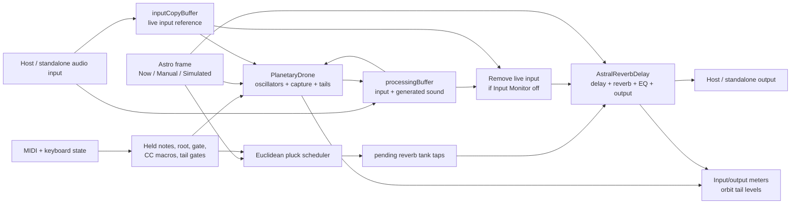
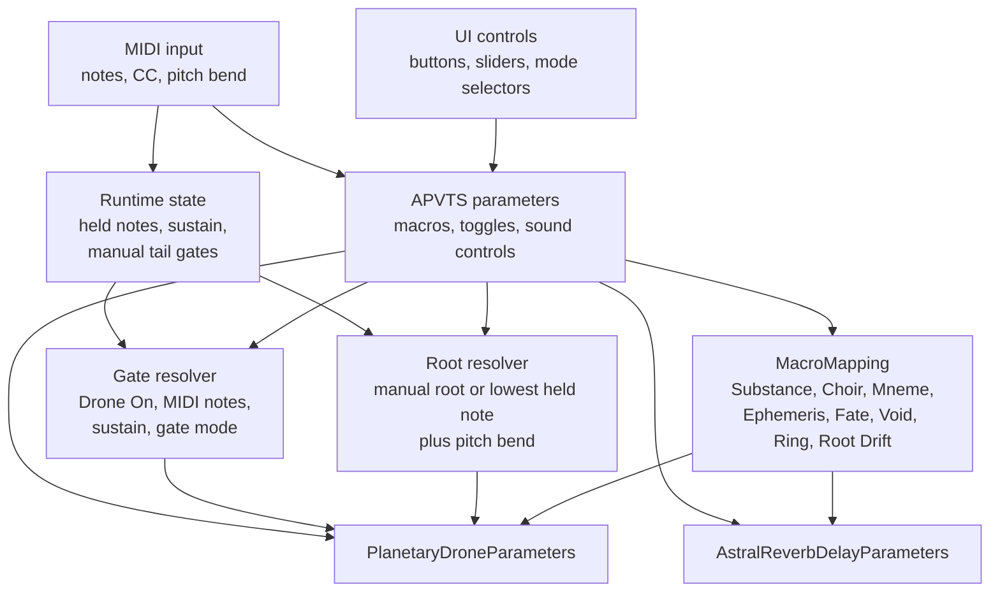
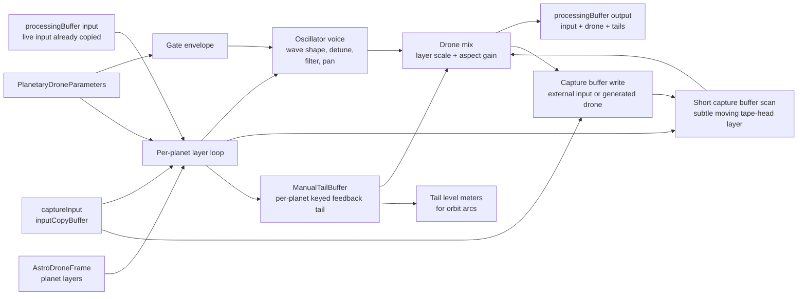
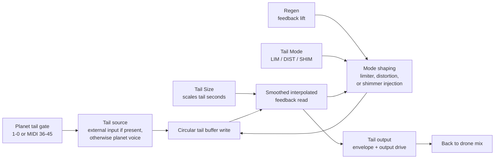
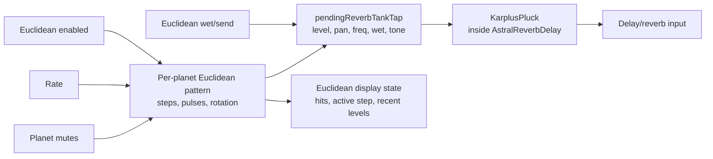
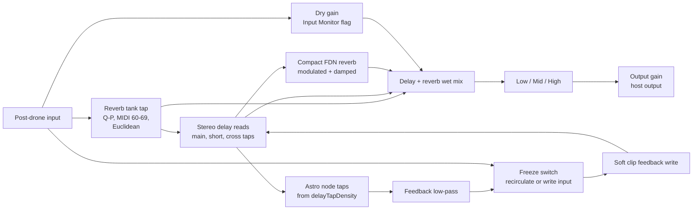

# Signal Path

This document describes the current audio-thread signal flow. It is meant as a debugging map for gain, crackle, capture, and MIDI-performance issues.

Primary source files:

- `Source/plugin/PluginProcessor.cpp`
- `Source/dsp/PlanetaryDrone.cpp`
- `Source/dsp/AstralReverbDelay.cpp`
- `Source/plugin/MacroMapping.cpp`

## Top-Level Audio Block

`AstralReverberationsAudioProcessor::processBlock` owns the per-block order. MIDI and control state are read first, then the internal drone/capture engine is rendered into a working stereo buffer, then the delay/reverb engine processes that result.

Important detail: when `Input Monitor` is off, the live input is subtracted from `processingBuffer` before the effect block. The remaining signal is the internal instrument signal, so the effect dry path is kept open for drone and tails.

## Control And Root Path

MIDI and UI controls do not directly write audio. They update parameter/state values that are sampled by the processor at block boundaries.

Performance mappings that affect audio routing:

- Held MIDI notes open the drone gate and can set root from the lowest held note.
- CC64 acts as sustain gate.
- MIDI notes `36-45` gate per-planet capture tails and auto-arm capture.
- MIDI notes `60-69` trigger reverb tank plucks.
- CC `20-29` drive the main macro/performance controls.
- CC `30-35` toggle Drone, Capture, Freeze, Euclidean, Manual Root, and Organ.
- Pitch bend offsets drone root and pluck frequency by the configured bend range.

## PlanetaryDrone Internals

`PlanetaryDrone` is both the oscillator instrument and the capture-tail source. It renders additively into the existing working buffer.

The drone path has three audible ingredients:

- Oscillator drone voices from planetary harmonic layers.
- Short captured-input scans, enabled by `Capture` and scaled by `Mneme`.
- Manual planet tails, excited by number keys or MIDI tail notes while capture is armed.

## Manual Orbit Tail Loop

Manual tails are separate from the main delay/reverb freeze. They are per-planet feedback loops inside `PlanetaryDrone`.

Crackle-sensitive points:

- `Tail Size` changes the feedback read distance.
- The read distance is smoothed before interpolation.
- `Regen` can approach very high feedback values, so the write path is bounded with soft limiting.
- `DIST` mode is intentionally nonlinear and can sound gritty at high regen.

## Euclidean And Tank Plucks

The Euclidean engine does not directly write to the drone buffer. It schedules one-shot plucks into the delay/reverb tank.

## Delay, Reverb, EQ, Output

`AstralReverbDelay` takes the post-drone working buffer and applies the main spatial instrument path.

DSP safety points:

- Delay time is smoothed per sample.
- Delay reads use interpolation.
- Feedback is low-pass filtered.
- Feedback writes are soft-clipped.
- Non-finite samples are sanitized.
- `Freeze` stops new dry input from entering the feedback loop.

## Practical Debug Map

Use this table when a symptom appears.

| Symptom | Most likely area | What to inspect |
|---------|------------------|-----------------|
| Drone is quiet with Input Monitor off | Top-level dry routing | `PluginProcessor.cpp` live-input subtraction and effect `inputMonitor` handoff |
| Crackle while moving tail controls | Manual orbit tail loop | Tail read smoothing, interpolation, regen value, `DIST` mode |
| Capture tails are not audible | `PlanetaryDrone` manual tails | `Capture`, Mneme/capture level, tail gate key, planet mute, input level |
| Euclidean display moves but no plucks | Euclidean scheduler | `euclid_enable`, rate, send/wet, planet mutes, pending tap queue |
| Plucks work but drone does not gate | Control/root path | Held notes, sustain, `Drone On`, gate mode, manual root |
| Output meter low despite active sound | Delay/reverb/output block | Wet/dry mix, Low/Mid/High, Output macro, limiter state |

